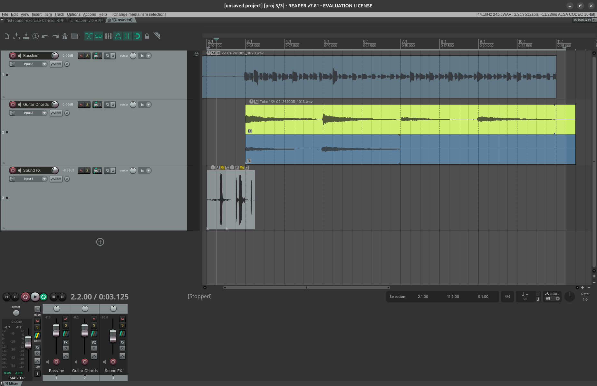
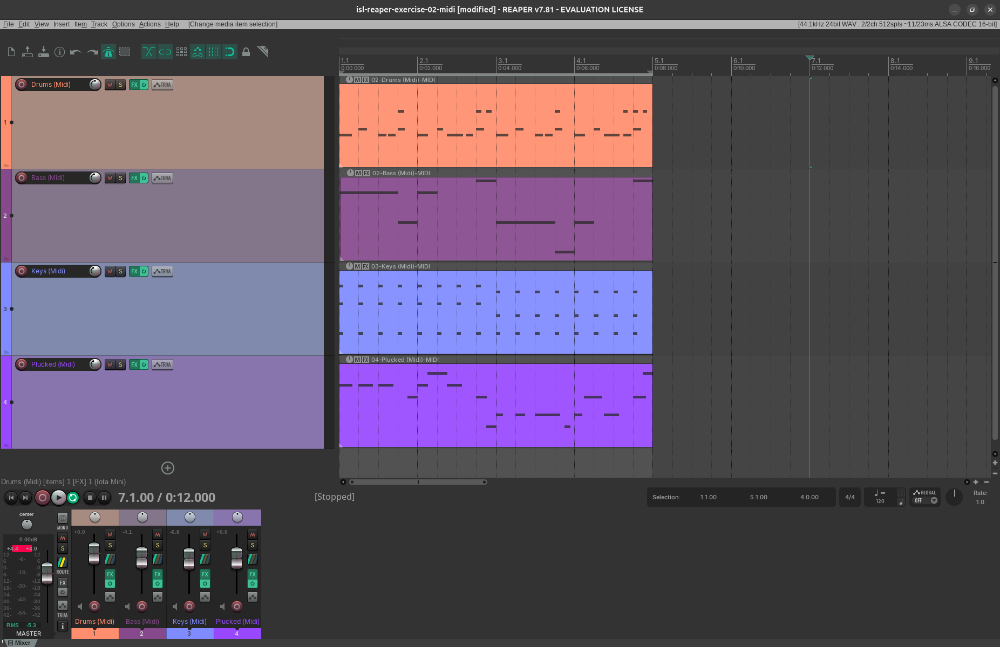

# Individual Skills Lab: Documentation of Learning Process

## Contents
- [Intro](#intro)
- [Reaper](#reaper)
- [Mixing Techniques](#mixing-techniques)
- [Audio Technology](#audio-technology)

## Intro

During the course of the Individual Skills Lab seminar, I will focus on the following 3 areas: working with **Reaper**, transitioning into **Mixing Techniques**, and finally learning the basics of recording in **Audio Technology**. The aim is to regain basic familiarity with using a DAW, gain basic audio production skills, as well as broaden my vocabulary within the audio field. We discussed that the reason I decided to not focus on Plugdata at the time being, is because I have had experience with visual programming before and am therefore more confident to learn as I go within this area. 

## Reaper

### Learning process

1. **Step 1: Watch the first part of Reaper's video tutorial series, take notes, and start getting familiar with the software.**

Before starting the tutorial videos, I decided to watch the [Benefits of reaper over other DAWS](https://www.reaper.fm/videos.php#PJrN23efnbw), to get a bit of context about Reaper before diving in. I also downloaded the user guide and skimmed through its table of content for further reference.

Next, I installed Reaper for my Linux distribution. The installation process was very straightforward, I didn't run into any issues at first and started the video tutorial series while following along with the software.

I went through the first 5 videos and took notes of all the tips mentioned, while trying out the different concepts demonstrated. It was definitely a lot of information at once, but the videos were well structured. It took me however much longer then the logged time, to get through the videos.

I followed along the videos to set up a project and test the guitar input, as well as the mic input with voice and violin. 

The interface I had was plug and play, I didn't need to install any drivers for it to work. 

I adjusted the volume of the different tracks using the mixers after recording, I here realized I didn't have the sliders on my interface set up correctly, so after these tests I continued with the rest of the videos before recording again. I made some cuts using the razor tool to made a first mix, but when I tried to loop one of the cut tracks by dragging it, it didn't work how i thought (extends original audio file, not the cut one), so i had to manually duplicate it with `CTRL` + drag. I must check this out before ending this topicc.

2. **Step 2: Create recordings in Reaper, while continuing videoseries**

It was quite hard to figure out how to start creating the artefact, as I never mixed music before, and have mainly worked with visual media only. At the start I thought about creating a sonification of game footage to give me a more defined space to work with. I decided against this, because I thought it would overcomplicate the current exercise, and it might be harder to demonstrate the learned concepts from the tutorial. 

Instead, I started with creating a simple bass loop on my guitar and work around this. This loop reminded me of a scene of somebody sitting down, opening a can and relaxing. So I thought about recording some sounds that captured that vibe and adding them to the music piece, a can opening, slurping sound, a sigh. I added some more strings to get a first interesting piece.

From here, I decided to continue with the videoseries, to get some more knowledge in how to add interesting elements.

During the 6th video, Recording Midi, I encountered a first issue with the Linux setup, when trying to install the `Iota mini` VSP. Since many VSP's are only built for Windows, I had to set up `wine` and `yabridge` to always be able to use VSP's built for Windows. It took me some time to resolve the issues the version conflicts created, but I was eventually able to get it running going through `yabridge`'s readme guides in detail. I am glad I read up into the docs and resolved this issue now, to avoid any further problems with my Linux setup.

Once the `Iota mini` plugin was properly setup, I followed through the video and had some fun testing out my MIDI keyboard. The workflow with Recording and timing the midi keys was a bit frustrating at first, but I found the MIDI Editor extremely helpful in refining the recorded notes. After continuing watching more tutorial videos, I then added a simple drumline to my project, and started playing around with effects.

### Resources

1. [Official docs video series: This is Reaper 7](https://www.reaper.fm/videos.php#0kEm36n8TKQ)

2. [Up and Running: A REAPER User Guide v 7.42](https://dlx.reaper.fm/userguide/ReaperUserGuide742l.pdf)

### Feedback

### Final Results

### Reflection

#### Before session of 06.10

- Learning by doing worked best for me: I followed the tutorials, and follow along with them, as well as experiment a bit while watching them. This made it so I spent a lot of time on the videos itself, but I remember the contents of them a lot better.
- Quite a bit of problem solving, e.g. clunky at first with interface (eg accidentally making selections in the ruler all the time), MIDI recording also took a lot of practice, and figuring out how to use VSTs built for Windows on my Linux distro 
- Hitting the target dB in recordings didn't always work
- Making creative decisions at the start was very challenging, I felt too unexperienced to create something out of nothing. This was a mental block I had to get over
- Some of the coolest DAW features for me were the MIDI editor with quantization, and the concept of buses and sends. I am also really excited to learn about automation and actions.
- Still missing a lot of Mixing knowledge, but luckily that is my next topic

### Notes & Timetracking

🕒 ***Total tracked time: approx. 13 hours***

---

  
Important keyboard shortcuts overview

  #### Keyboard shortcuts
  - `CTRL + P` preferences
  - `V` volume detail view
  - `P` pan detail view
  - `CTRL + R` start recording
  - `CTRL + T` new track
  - `SHIFT + G` Track grouping dialog
  - `ALT + B` Open virtual midi keyboard
  - `S` slices item at current timestamp
  - `SHIFT + F` FX Browser

  #### Mouse actions
  - `trim`:  middle of edges of audio files
  - `fade`: top of edges of audio files
  - `volume`: drag up and down from top
  - `stretch item` middle of edges while pressing 
  `ALT`
  - `Lasso selection`: right click drag
  - `Razor tool`: `ALT` + right click drag (hold `SHIFT` for multiple razor edit areas)

---

  
30.09.2026: 🕒 1 hour

  #### Introduction to tutorials: [Benefits of reaper over other DAWS](https://www.reaper.fm/videos.php#PJrN23efnbw)

- easy to download, try
- very small build size, opens and closes extremely fast compared to large DAWs
- portable install available so easy to bring a whole project to any device, have multiple versions with diff settings
- highly customizable: theme, prefs, mouse modifiers, menus,  toolbars, custom actions
- track links, comping (creating multiple versions then selecting the final)
- effect chains: group of effects and settings that can be reused ("save all effects as chain"/ "load chain" eg with keyboard shortcut), grouping effects together in "containers". 
- Freeze tracks: render fx into audio file, unfreeze when needed
- Effects can be not only set on tracks, but also on mediafiles within a track, so multiple parts in 1 track can have multiple different sets of effects.
- Unified track type: no difference track types needed for video, stereo sound or mono sound, midi / instrument track
- actions auto available based on mouse pos, modifiers available
- envelopes
- track(s) can be saved as "Track template", letting you import into diff templates, or just use copy/paste
- grouping, child tracks
- label with regions instead of markers. Regions can be moved around for changing arrangement
- automation items
- embed fx into tracks
- `Megababy`: step sequencer, easy to use and to explore when learning
- Easy switching between workspaces
-  Render queue

#### In action

Setted up pc, installed reaper for linux, thoughts: very easy to find, no issues so far

---

  
03.10.2026: 🕒 2 hours

  
  #### Video 1: [Intro](https://www.reaper.fm/videos.php#0kEm36n8TKQ)

  - double click in tracks to generate new empty tracks
  - Timeline/ruler can be divided in multiple ways: bars:beats / mins:secs/ timecode / samples
  - Add samples by dragging into timeline or tracks,  below existing tracks
  - Toolbar: snap to grid
  - all files are **items**: basic actions such as copy/paste, trim (multiselect available)
  - by default, all items are looped, extendable by dragging out
  - Toolbar: razor tool to cut out part of samples
  - Track control panel: adjust volume, mute/solo (drag for multiselect), pan track, fx button, routing button (sends)
  - Adjust BPM, or rate, double click to reset to default
  - Context menu on right click of items, tracks, ruler, solo/mute button, ...

  #### Video 2: [Starting a New Project](https://www.reaper.fm/videos.php#hLB83sOxVfs)

- Top right of taskbar: see/change audio device prefs
- Sample rate: `48000`
- Block size: `128` -> Larger block size for larger projects, lower block size for less latency, 128 for balance

- `Preferences > Poject > Prompt to save on new project`
- Save project dialog: check `Create subdirectory for project` and `Copy all media into project directory`
- `Preferences > Project > Backup > Audo-save on timestamped file`
- `Preferences > Poject > Open properties on new project` -> opens Project Settings dialog on create
- Change project settings: `info` button in toolbar

#### Video 3: [The Tracks](https://www.reaper.fm/videos.php#L5E1enayMQY)

- Duplicate tracks (right click context menu)
- Rename multiple: double click one, then tab for auto selecting next track
- Create multiple: `Insert > Multiple tracks` or right click on track control panel
- Track menu also available on right click track selection
  - Color tracks: `Tracks > Track color > Set tracks to custom color...` 
  - Add icon to tracks: `Tracks > Track icon > Set track icon` 
  - Visual spacers: `Tracks > Visual spacer > Insert spacer before and after track` 
- Double click knobs to reset to default
- Grouping tracks: `SHIFT + G` opens Grouping dialog, linking properties between tracks within a group
  - Within a group: hold `SHIFT` to change individual track props
  - *Temporary groups* is same as multiselecting, `SHIFT` also works here

#### In action:

Setup of reaper on linux was easy, audio interface setup was plug and play with no installing of drivers needed. 

I followed along the videos to set up a project and test the guitar input, as well as the mic input with voice and violin. 
I adjusted the volume of the different tracks using the mixers, probably better way is too adjust the sliders to a good level during recording, will learn about this later. I made some cuts using the razor tool to made a first mix, but when I tried to loop one of the cut tracks by dragging it, it didn't work how i thought (extends original audio file, not the cut one), so i had to manually duplicate it with `CTRL` + drag. Continuing tomorrow with the rest of the tutorial videos to learn more about recording.

---

  
04.10.2026: 🕒 4 hours

#### Video 4: [Recording Audio - Part 1](https://www.reaper.fm/videos.php#CKHWK3oTj-A)

- Target level: between around `-12db` and `-18dB`, adjust knobs on interface to match this range
- Toolbar: Metronome
- Monitoring modes: right click on speaker icon in record mode, turn of `Monitor input` to not hear the output when recording.
- `Direct monitoring` setting on interface will eliminate latency alltogether, when using, turn off Monitor input in Reaper
- `Monitor input (Tape Auto Style)`: only hear the input track when recording is active, useful for overriding a part of the track (punch in/out)
- Punching in/out create different **takes**, click the one you want to hear in playback
- Choose one take and delete the other by selecting all audio in track (double click track), right click context menu, `Take > Crop to active take`
- Switch to `Tape mode` in `Options > New recording that overlaps existing media items > Trim existing items (tape mode)`
- You can extend the punches or crossfade with the existing take

#### Video 5: [Recording Audio - Part 2](https://www.reaper.fm/videos.php#U0Tv1waD1sY)

- **Auto punching**
  - `Options > Record mode: time selection auto punch`, in the ruler, draw in a time section where the recording will be active.
  - `Options > Record mode: auto-punch selected items`, use slices to split track into multiple items, then select the parts you want to overwrite
  - Recording modes also available on right click on record button in Transport 
- Record into **lanes** instead of using takes:
  - `Options > New recording that overlaps existing media items >  Add lanes`
  - To temporarily choose a preferred lane, but only hide not delete the other tracks, simply press `Disable lanes (hide non-playing tracks)` (right click on play icon by lanes)
  - Right click on lane, `Comping > Comp into new empty lane`. The comped lane are marked as gold, when double clicking it toggles comp mode.

#### Additional resources

*Go over these again in detail later.*

[Fundamentals of Rhythm for Electronic Music](https://www.youtube.com/watch?v=JE3QM_9sljI)

[Sound Design and Synth Fundamentals](https://www.youtube.com/watch?v=NJLIS2MkFe4)

#### In action

Started first recording session in Reaper, played around with a few riffs, then started appliying the principles from the videos, see details in Learning process.

  

---

  
05.10.2026: 🕒 6 hours

  #### Video 6: [Recording Midi](https://www.reaper.fm/videos.php#HOcJ31SIj68)

- Free VST instrument plugin: `Iota mini`
- Setup MIDI Keyboard: `Preferences  > MIDI Inputs`: select `input` / `all` and optionally `Control` (for linking with actions)
- Create track, select `Input: MIDI` as source, select all channels
- `View > Virtual Midi keyboard`
- MIDI recording: go to `in` at the track, select `Record: MIDI overdub/replace > Record MIDI overdub`, this won't overwrite the notes on the previous pass when adding more passes
- Metronome settings (right click): `Count-in before recording`
- Fix midi recording by double clicking to view `Midi editor`, this lets you clean the recording
  -  **Quantizing** the notes aligns the notes on the grid, press the `Q` icon for the `Quantize Events` dialog, Settings: `Manual`, Quantize: `All notes`, Grid: e.g. `1/8`
  - Quantize `Position and note end` to also align the notes' length to the grid (useful for basslines for example)
  - **Adjust velocity** by selecting all notes, then dragging up the velocity values (to set all notes to full volume)
- in `Iota Mini`, some good presets include:
  - `Trap Drum Kit 06` for Drums
  - `808 - Rumble` for Bass
  - `Keys - Eternity` for Keyboard
  - `Pluck - Soft` for Guitar
- Quantize during recording: in Track control right click IN FX `MIDI: All` button, and go `Track recording settings > Input Quantize MIDI recording`, also optionally select `Quantize note-offs`
- Set selected notes to same length: Selection > `Event properties...` -> length eg `0.0.2`

  #### Video 7: [Basic Audio Editing](https://www.reaper.fm/videos.php#EGL54WGa85A)

- Hold down SHIFT to temporary toggle snapping
- `Snap/Grid` settings dialog on right click: Turn off `Snap to grid at any distance` to have a less rigid snapping
- Right click on fade to adjust the fading curve
- Hold `Alt` to slide recording contents
- Split items using `S` key, select all, right click: `Heal splits in items`
- `CTRL` Drag to duplicate
- `Crossfade` icon in toolbar sets default crossfade on overlap off
- `Options > Trim content behind media items when editing` for avoiding media items playing at same time
- Lasso selection at right click + drag
- Multiselect fading only works with vertically aligned items

 #### Video 8: [FX & Plugins](https://www.reaper.fm/videos.php#lFDv75U0nO0)

- Find plugins by filtering on keyword (EQ, compressor, dynamics, etc)
- `View > FX Browser` (`SHIFT + F`) opens browser for selected track, or without selected track, drag and drop to tracks
  - Drag often used effects into `Favorites` folder
  - Create custom folders, optionally `Smart folder` where all effects with certain keywords can go
- Change order of effects in FX detail dialog
- Double click to pop single  effect into a floating dialog
- Right click on list: `FX chains > Save all FX as chain...`, it then appears into the `FX Chains` folder in the FX Browser
- Right click on `FX` icon in Track control panel, to see recently used, categories, FX Chains, etc
- Press off button next to `FX` icon to bypass effects temporarily (turns red)
- `ALT` click `FX` icon to delete all effects
- Drag and drop FX at a track to copy to another
- `ALT` + Drag and drop to move it instead
- The same actions are also available in the Track control panel and in the mixer
- In the mixer, holding down `SHIFT` while clicking lets you bypass effects seperately
- Normal FX do not change anything about the recording, but Input FX do get printed

#### Video 9: [Sends & Busses](https://www.reaper.fm/videos.php#pfHGwzNyFC8)

- `Route` -> `Master send` of parent track outputs to speaker
- `Route` icon changes color based on its mode: cyan when master send is on, yellow when it is being sent, and blue when a track is receiving a send
- Turning the master send off, can be useful when you want to `send` it to another track or a buss
- `Post-Fader`, eg when changing the volume of the send effects the buss's input audio, `Pre-Fader` (eg for headphone mixes) and `Pre-FX` modes available too
- Drag and drop from `Route` button to create a send, hold down `SHIFT` for multiple tracks
- Holding down `ALT` for turning off master send
- Why use sends ? Helps control multiple tracks at the same time (joined volume control, shared fx). Can be also useful for creating **parallel effects** where you can blend in a version of itself, eg highly distorted 
- Also possible to use sends/buses as fx returns: create reverb on a buss, then adjust the balance in the `Routing` window under `Sends` / `Receives`

 #### Video 10: [Folders](https://www.reaper.fm/videos.php#GGY4UYBbxyM)

- Folders are containers for multiple tracks, used for similar reasons as busses/sends
-To create a folder from a track, go to the `Folder` icon in the left bottom of the track, which then turns into a plus sign, sending all tracks underneath into the folder. Alternatively drag and drop tracks into `Folder` icon of parent
- Folders are nestable, opening up interesting workflows. Allows us to control things in a broader way, eg all drums, all guitar, etc
- Folders are collapsible on two additional levels, keeping big projects neater.
- Actions > filter on 'Folder' > Track: Cycle folder collapsed state` -> add keyboard shortcut if used often
- Tracks are also intended based on folder level, when it is missing turn back on in context > `Show folders`
- Subtracks can be hidden in mixer by unchecking context > `Show tracks that are in folders`

#### Video 11: [Track Grouping](https://www.reaper.fm/videos.php#3tmI88BKnb8)
#### Video 12: [Markers & Regions](https://www.reaper.fm/videos.php#3tmI88BKnb8)

-  
#### In action

To use VST's built for windows on linux, I followed this guide on reddit into using `yabridge`: [Reaper and VST support on Linux (Mint)](https://www.reddit.com/r/Reaper/comments/1o4o05s/reaper_and_vst_support_on_linux_mint/). After fixing the compatibility issues, the plugin shows up correctly. Spent some time getting used to recording with the MIDI keyboard.

By default, the routing buttons where turned off in my interface. I reenabled them by setting the layout of the track control panel: `Options > Layouts > Track Panel > (View) B`

Continued on prototype by adding MIDI drum track, and started playing around with FX.

## Mixing Techniques

### Learning process

### Resources

### Feedback

### Final Results

### Reflection

## Audio Technology

### Learning process

### Resources

### Feedback

### Final Results

### Reflection
