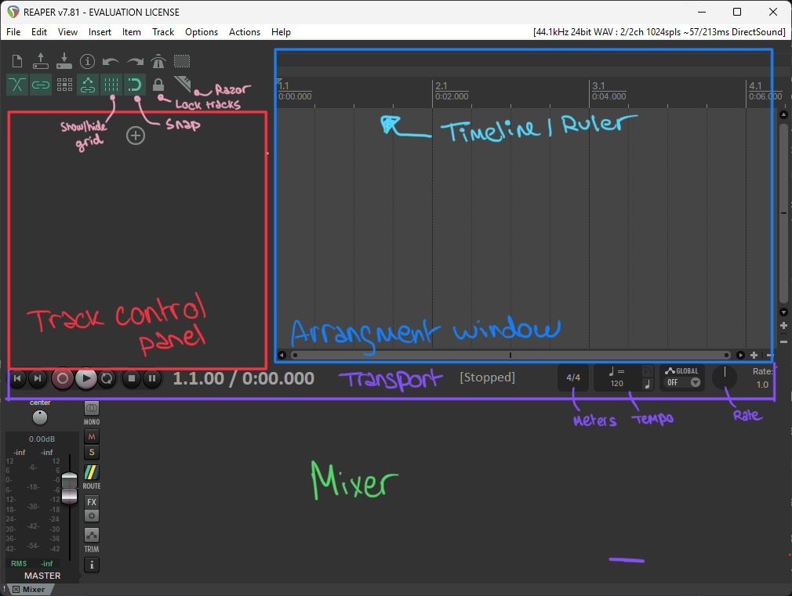
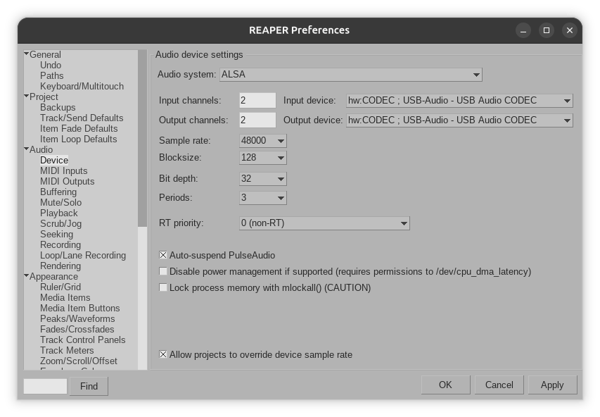
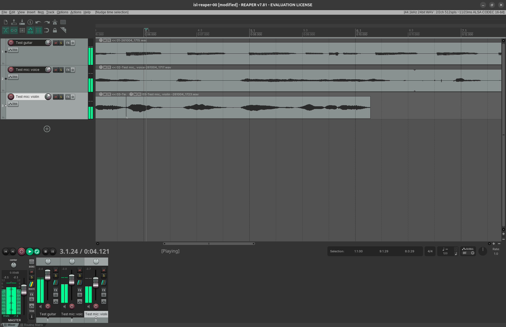

# Individual Skills Lab: Documentation of Learning Process

## Contents
- [Intro](#intro)
- [Reaper](#reaper)
- [Mixing Techniques](#mixing-techniques)
- [Audio Technology](#audio-technology)

## Intro

During the course of the Individual Skills Lab seminar, I will focus on the following 3 areas: working with **Reaper**, transitioning into **Mixing Techniques**, and finally learning the basics of recording in **Audio Technology**. The aim is to regain basic familiarity with using a DAW, gain basic audio production skills, as well as broaden my vocabulary within the audio field. We discussed that the reason I decided to not focus on Plugdata at the time being, is because I have had experience with visual programming before and am therefore more confident to learn as I go within this area. 

## Reaper

### Learning process

1. **Step 1:** Follow Reaper's video tutorial series, take notes, and start getting familiar with the software.

### Resources

1. [Official docs video series: This is Reaper 7](https://www.reaper.fm/videos.php#0kEm36n8TKQ)

2. [Up and Running: A REAPER User Guide v 7.42](https://dlx.reaper.fm/userguide/ReaperUserGuide742l.pdf)

### Feedback

### Final Results

### Reflection

### Notes & Timetracking

🕒 *Total tracked time: approx. 1 hour*

---

  
30.09.2026: 🕒 1 hour

  #### Introduction to tutorials: [Benefits of reaper over other DAWS](https://www.reaper.fm/videos.php#PJrN23efnbw)

- easy to download, try
- very small build size, opens and closes extremely fast compared to large DAWs
- portable install available so easy to bring a whole project to any device, have multiple versions with diff settings
- highly customizable: theme, prefs, mouse modifiers, menus,  toolbars, custom actions
- track links, comping (creating multiple versions then selecting the final)
- effect chains: group of effects and settings that can be reused ("save all effects as chain"/ "load chain" eg with keyboard shortcut), grouping effects together in "containers". 
- Freeze tracks: render fx into audio file, unfreeze when needed
- Effects can be not only set on tracks, but also on mediafiles within a track, so multiple parts in 1 track can have multiple different sets of effects.
- Unified track type: no difference track types needed for video, stereo sound or mono sound, midi / instrument track
- actions auto available based on mouse pos, modifiers available
- envelopes
- track(s) can be saved as "Track template", letting you import into diff templates, or just use copy/paste
- grouping, child tracks
- label with regions instead of markers. Regions can be moved around for changing arrangement
- automation items
- embed fx into tracks
- `Megababy`: step sequencer, easy to use and to explore when learning
- Easy switching between workspaces
-  Render queue

#### Overview mouse actions
- `trim`:  middle of edges of audio files
- `fade`: top of edges of audio files
- `volume`: drag up and down from top

#### In action

Setted up pc, installed reaper for linux, thoughts: very easy to find, no issues so far

---

  
03.10.2026: 🕒 2 hours

  
  #### Video 1: [Intro](https://www.reaper.fm/videos.php#0kEm36n8TKQ)

  - double click in tracks to generate new empty tracks
  - Timeline/ruler can be divided in multiple ways: bars:beats / mins:secs/ timecode / samples
  - Add samples by dragging into timeline or tracks,  below existing tracks
  - Toolbar: snap to grid
  - all files are **items**: basic actions such as copy/paste, trim (multiselect available)
  - by default, all items are looped, extendable by dragging out
  - Toolbar: razor tool to cut out part of samples
  - Track control panel: adjust volume, mute/solo (drag for multiselect), pan track, fx button, routing button (sends)
  - Adjust BPM, or rate, double click to reset to default
  - Context menu on right click of items, tracks, ruler, solo/mute button, ...

  #### Video 2: [Starting a New Project](https://www.reaper.fm/videos.php#hLB83sOxVfs)

- Top right of taskbar: see/change audio device prefs
- Sample rate: `48000`
- Block size: `128` -> Larger block size for larger projects, lower block size for less latency, 128 for balance

- `Preferences > Poject > Prompt to save on new project`
- Save project dialog: check `Create subdirectory for project` and `Copy all media into project directory`
- `Preferences > Project > Backup > Audo-save on timestamped file`
- `Preferences > Poject > Open properties on new project` -> opens Project Settings dialog on create
- Change project settings: `info` button in toolbar

#### Video 3: [The Tracks](https://www.reaper.fm/videos.php#L5E1enayMQY)

- Duplicate tracks (right click context menu)
- Rename multiple: double click one, then tab for auto selecting next track
- Create multiple: `Insert > Multiple tracks` or right click on track control panel
- Track menu also available on right click track selection
  - Color tracks: `Tracks > Track color > Set tracks to custom color...` 
  - Add icon to tracks: `Tracks > Track icon > Set track icon` 
  - Visual spacers: `Tracks > Visual spacer > Insert spacer before and after track` 
- Double click knobs to reset to default
- Grouping tracks: `SHIFT + G` opens Grouping dialog, linking properties between tracks within a group
  - Within a group: hold `SHIFT` to change individual track props
  - *Temporary groups* is same as multiselecting, `SHIFT` also works here

#### Keyboard shortcuts
- `CTRL + P` preferences
- `V` volume detail view
- `P` pan detail view
- `CTRL + R` start recording
- `CTRL + T` new track
- `SHIFT + G` Track grouping dialog

#### In action:

Setup of reaper on linux was easy, audio interface setup was plug and play with no installing of drivers needed. 

I followed along the videos to set up a project and test the guitar input, as well as the mic input with voice and violin. 
I adjusted the volume of the different tracks using the mixers, probably better way is too adjust the sliders to a good level during recording, will learn about this later. I made some cuts using the razor tool to made a first mix, but when I tried to loop one of the cut tracks by dragging it, it didn't work how i thought (extends original audio file, not the cut one), so i had to manually duplicate it with `CTRL` + drag. Continuing tomorrow with the rest of the tutorial videos to learn more about recording.

## Mixing Techniques

### Learning process

### Resources

### Feedback

### Final Results

### Reflection

## Audio Technology

### Learning process

### Resources

### Feedback

### Final Results

### Reflection
